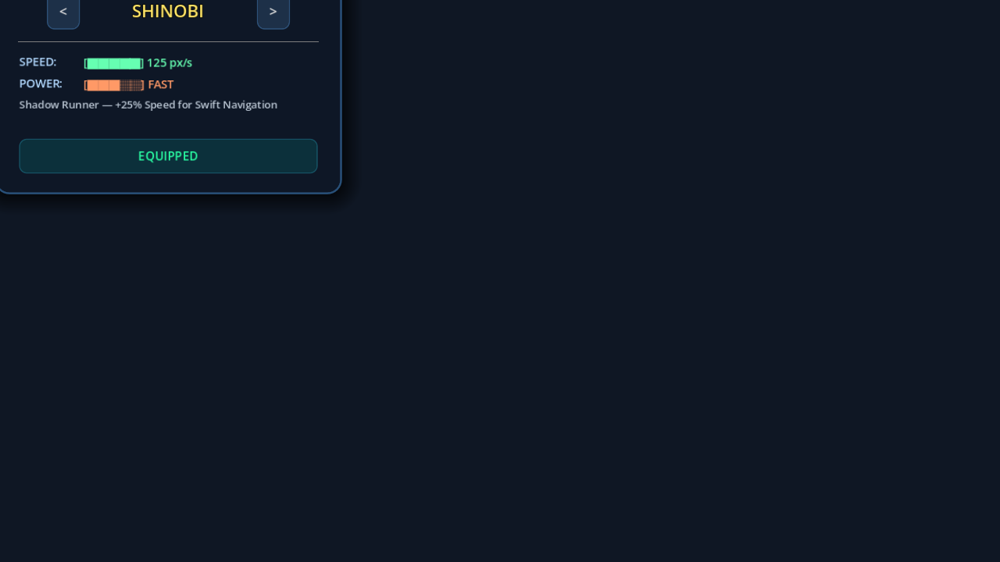
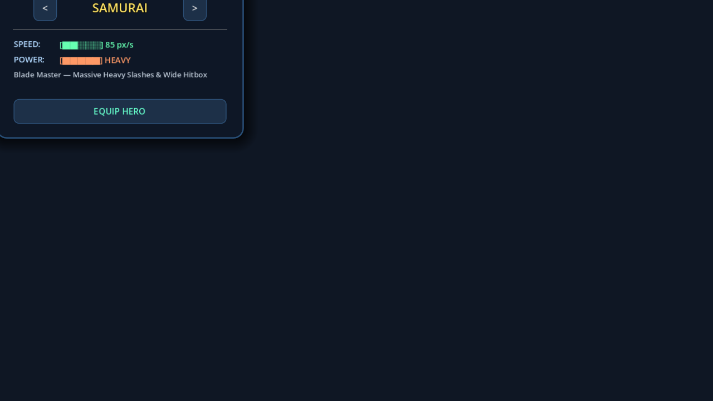
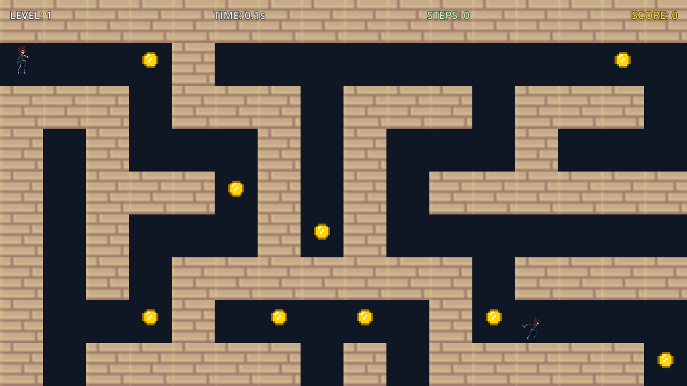

# Maze Labyrinth

**Maze Labyrinth** is an action-adventure procedural maze crawler built in **Godot 4.7 (GDScript)**. Navigate procedurally generated 2D mazes, collect gold coins, execute 3-hit sword combos to defeat Shinobi enemies, and unlock progressive level scaling!

---

## Game Screenshots

| Main Menu & Hero Hub | Character Stats & Selection | Gameplay & Combat |
| :---: | :---: | :---: |
|  |  |  |

---

## Key Features

- **Procedural Maze Generation**: Infinite unique mazes generated using a recursive backtracker algorithm.
- **Hero Selection Hub**: Choose between 3 unique playable characters, each with distinct speed ratings, attack hitboxes, and special traits:
  - **Fighter** (*Master Duelist*): Balanced speed and precision 3-hit combo strikes.
  - **Shinobi** (*Shadow Runner*): +25% movement speed for rapid maze navigation.
  - **Samurai** (*Blade Master*): Heavy slashes with an extended strike area.
- **3-Hit Combo Combat**: Execute 3-hit sword strike combos (`Attack 1` → `Attack 2` → `Attack 3`) to defeat patrolling and chasing enemies.
- **Corridor Line-of-Sight AI**: Shinobi enemies patrol corridors and initiate a high-speed chase when you enter their line of sight.
- **Gold Coins & Score System**: Collect floating pixel-art gold coins scattered throughout corridors to build your total score.
- **Retro Glitch Death Effect**: A chromatic screen glitch and static sound effect upon defeat before respawning.
- **Save & Resume System**: Auto-saves your level progress and total score so you can resume anytime from the Main Menu.
- **Close-up Follow Camera**: Dynamic close-up follow camera with smooth boundary clamping.

---

## Controls & Shortcuts

| Action | Control |
| :--- | :--- |
| **Movement** | `WASD` or `Arrow Keys` |
| **Attack Combo** | `Spacebar`, `Left Click`, or `J` |
| **Pause / Return to Menu** | `ESC` |
| **Quick Restart Level** | `R` |
| **Next Level (Victory Screen)** | `N` |
| **Main Menu (Victory Screen)** | `Q` |

---

## Built With

- **Engine**: Godot Engine 4.7 (Forward+ Renderer)
- **Language**: GDScript
- **Audio**: Custom Synthesized 8-bit PCM Chiptunes & Audio Effects

---

## Downloads & Releases

Pre-compiled standalone Windows executables are available on the [GitHub Releases](https://github.com/Ronak-jain-afk/maze-labyrinth/releases) page.

---

## Running from Source

1. Clone this repository:
   ```bash
   git clone https://github.com/Ronak-jain-afk/maze-labyrinth.git
   ```
2. Open the project folder in **Godot Engine 4.7+**.
3. Press `F5` to play!
